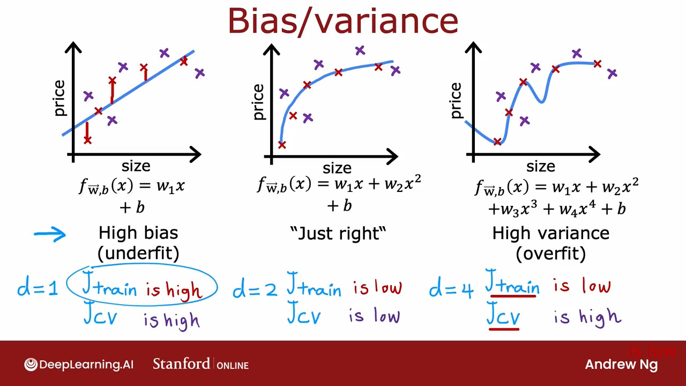
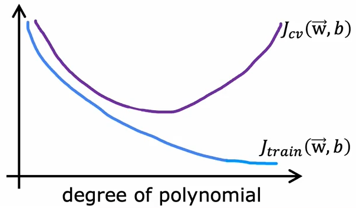
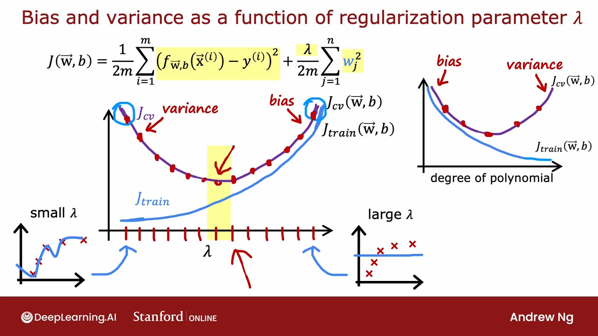
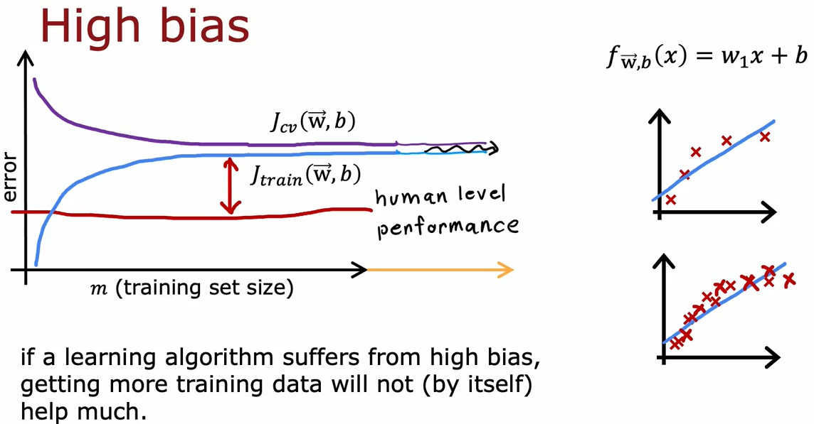
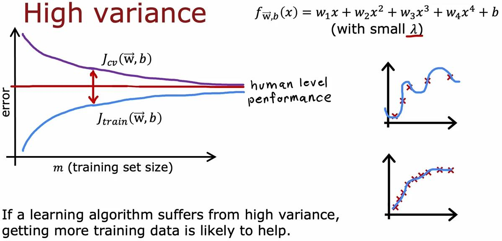

# Advise for applying machine learning

## Evaluating a model

We could detect the models issues by plotting the features and the predicting line, but as the number of features grows, plotting becomes harder.

Split the dataset into _training set_ and _test set_. Train the model on _training set_ and then evaluate the models performance by the test set.

1. Fit parameters by minimizing cost function $J(\vec{w}, b)$

    $$J(\vec{w}, b) = \left[\dfrac{1}{2m_{train}}\displaystyle\sum_{i=1}^{m_{train}}{(f_{\vec{w},b}(\vec{x}^{(i)})-y^{(i)})^2}+\dfrac{\lambda}{2m_{train}}\displaystyle\sum_{j=1}^{n}{w_j^2}\right]$$

2. Compute test error

    $$J_{test}(\vec{w}, b) = \dfrac{1}{2m_{test}}\left[\displaystyle\sum_{i=1}^{m_{test}}{(f_{\vec{w},b}(\vec{x}\_{test}^{(i)})-y_{test}^{(i)})^2}\right]$$

3. Compute training error

    $$J_{train}(\vec{w}, b) = \dfrac{1}{2m_{train}}\left[\displaystyle\sum_{i=1}^{m_{train}}{(f_{\vec{w},b}(\vec{x}\_{train}^{(i)})-y_{train}^{(i)})^2}\right]$$

If the $J_{train}$ is optimal and $J_{test}$ is high, the model's probably overfitting.

The same 1, 2, and 3 steps goes for classification models too, except the $J()$ function will change accordingly.  
there's also a more common way to calculate the $J_{train}$ and $J_{test}$ for classification problems:

$J_{train}$ is the fraction of _training set_ that has been misclassified.  
$J_{test}$ is the fraction of _test set_ that has been misclassified.

## Model selection and Training/Cross validation/Test sets

To choose the best model architecture amongst the models that we have defined, we could calculate the $J_{test}$ of all models and select the one with the least loss, but what if that architecture overfits and only performs well on the test set that you have provided?

In this approach, we split the model into 3 sets: _Training set_, _Cross validation set_, _Test set_. Then we train the models on _training set_ and select the best model based on _Cross validation error_ and then we could evaluate the accuracy of selected model by calculating the _Test set error_.

_tip)_ Cross validation set is also called _validation set_, _development set_ and _dev set_.  

_tip)_ We show the Cross validation cost function as $J_{cv}$.

_tip)_ Assign most of the data to the _training set_ and divide the rest between the _CV_ and _test_ sets

Training error: $\qquad J_{train}(\vec{w}, b) = \dfrac{1}{2m_{train}}\left[\displaystyle\sum_{i=1}^{m_{train}}{(f_{\vec{w},b}(\vec{x}^{(i)})-y^{(i)})^2}\right]$

Cross validation error: $\qquad J_{cv}(\vec{w}, b) = \dfrac{1}{2m_{cv}}\left[\displaystyle\sum_{i=1}^{m_{cv}}{(f_{\vec{w},b}(\vec{x}\_{cv}^{(i)})-y_{cv}^{(i)})^2}\right]$

Test error: $\qquad J_{test}(\vec{w}, b) = \dfrac{1}{2m_{test}}\left[\displaystyle\sum_{i=1}^{m_{test}}{(f_{\vec{w},b}(\vec{x}\_{test}^{(i)})-y_{test}^{(i)})^2}\right]$

It worth nothing that if the selected model performs bad on the _test set_ we can conclude that it's overfits and we can select the nex-best-model in _cross validation error_.

## Diagnosing bias and variance

Looking at the _bias_ and _variance_ of a model gives a really good insight of how the model is performing, but we can't easily plot the output of a model in order to detect high or low bias and variance; therefore a more systematic way to diagnose the algorithm would be to look at the performance of algorithm on the _training_ and _CV_ sets.

Bias = _Training error_ $\longrightarrow$ underfitting  
Variance = Difference between _training_ and _testing_ error $\longrightarrow$ overfitting





High bias:  
$J_{train}$ is high  
$J_{train} \approx J_{cv}$

High variance:  
$J_{cv} \gg J_{train}$  
$J_{train}$ may be low

High bias and variance(rare situation, where a part of the input _overfits_ and another part _underfits_):  
$J_{train}$ is high  
$J_{cv} > J_{train}$

## Regularization and bias/variance

$\text{Model:} \quad f_{\vec{w},b}(\vec{x}) = w_1x + w_2x^2 + w_3x^3 + w_4x^4 + b$

$\text{Cost:} \quad J(\vec{w},b) = \dfrac{1}{2m}\displaystyle\sum_{i=1}^{m}{(f_{\vec{w},b}(\vec{x}^{(i)})-y^{(i)})^2}+\dfrac{\lambda}{2m}\displaystyle\sum_{j=1}^{n}{w_j^2}$

By choosing a large $\lambda$, the effect of the quadratic function will be minimized and $f_{\vec{w},b}(\vec{x}) = b$.  
And by choosing a small $\lambda$, the effect of normalization will be minimized and the function will end up just as before.

To choose the best $\lambda$ we can train different models with different $\lambda$s on the _training set_ and select the best model based on _CV loss_ of each model.



## Estimating a baseline level of performance

To get an estimate of what's the good performance you need to determine a base line level of performance.

1. What's the level of error you can reasonably hope to get to?
   - Human level performance
   - Competing algorithms performance
   - Guess based on experience

If the difference between the _baseline level of performance_ and the _training error_ is high, it means you have _high bias_ problem.  
If the difference between the _training error_ and _CV error_ is high, it means you have _high variance_ problem.

## Learning curves

<image src="./assets/img-4.png" height="200px">

As the of _training set size_ grows, the _training error_ and _CV error_ converge and get lower.

_CV error_ will typically be higher than _training error_.



However if the model has a _high bias_ and underfits, throwing more data at it will not make it more accurate. The _CV_ and _training_ errors flatten and continue for infinity.



In the case of _high variance_, at the beginning, the _training error_ and _CV error_ get close to the _baseline accuracy level_ and the _training error_ might even converge with the _base level_ but _CV error_ is so high.

If we increase the _training set size_, both the training and CV error might converge and get a better performance.

## Deciding what to do next(revised)

So based on what we learns about high _bias_ and _variance_; we can do the following, if the algorithm has a _hight bias_:  

- Try getting additional features
- Try adding polynomial features
- Try decreasing $\lambda$

And the following, if the algorithm has a _hight variance_:

- Get more training examples
- Try smaller sets of features
- Try increasing the $\lambda$

> Bias and Variance are one of those concepts that take a short time to learn and a life time to master.

## Bias/Variance and neural networks

Although growing a neural network larger, increases the chance of overfitting; by choosing the right regularization, it almost always performs _better or at least equally good_ as the old model. But theres always the caveat of increasing the computational requirements.

Unregularized MNIST model:

```python
layer_1 = Dense(units=25, activation='relu')
layer_2 = Dense(units=15, activation='relu')
layer_3 = Dense(units=1, activation='sigmoid')
model = Sequential([layer_1, layer_2, layer_3])
```

Regularized MNIST model:

```python
layer_1 = Dense(units=25, activation='relu', kernel_regularizer=L2(1e-2))
layer_2 = Dense(units=15, activation='relu', kernel_regularizer=L2(1e-2))
layer_3 = Dense(units=1, activation='sigmoid', kernel_regularizer=L2(1e-2))
model = Sequential([layer_1, layer_2, layer_3])
```

_tip)_ The parameter of `L2()` is $\lambda$

Final notes:

- It almost always never hurts to have a larger neural network as long as you can effort the computational power
- As long as your training set isn't too large; the neural network(specially large neural network) is often a low bias machine and just fits complicated functions very well.
