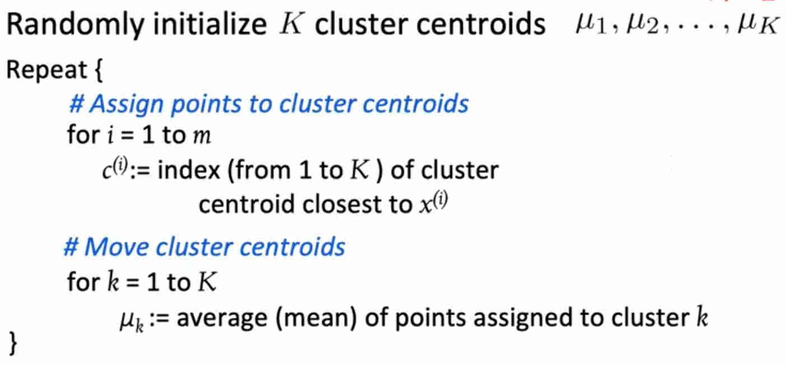
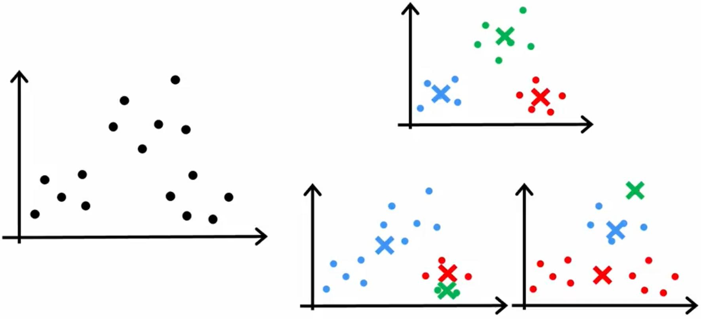
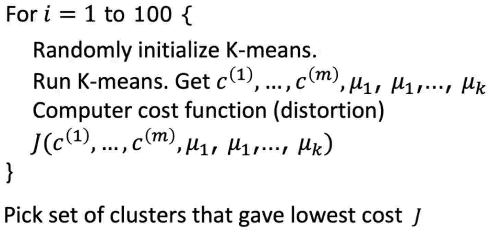
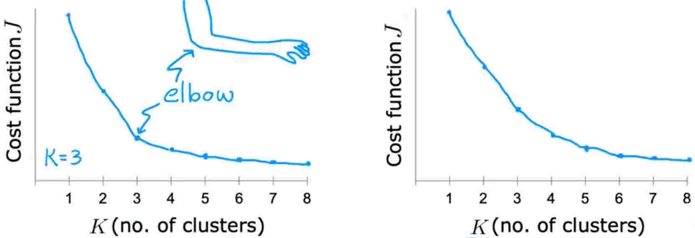

# Week 1 - Unsupervised learning

## K-means intuition

K-means algorithms tries to find the clusters or groups of similar examples in a dataset.

The way it does this operation for a two clusters is:

1. Pick two random points called _centroids_
2. Calculate the distance of examples from centroids, and relate each example to the closest centroid
3. Calculate the _mean_ of $(x, y)$ for corresponding points to each centroid
4. Move the centroids to the calculated means
   1. If the centroids didn't move, finish the job
   2. Else, go to step 2

## K-means algorithm

If no points where assigned to one of the randomly picked centroids at first, we can:

1. Remove the empty centroid
2. Randomly pick another centroid

_tip)_ We can even use the K-means algorithm in datasets with close examples.

## Optimization objective

$c^{(i)}$ = index of cluster ($1$, $2$, ..., $K$) to which example $x^{(i)}$ is currently assigned

$\mu_k$ = cluster centroid $k$

$\mu_{k^{(i)}}$ = cluster centroid $k$ of cluster to which example $x^{(i)}$ has been assigned

Cost function for K-means:

$$J(c^{(1)}, \dotsb, c^{(m)}, \mu_1, \dotsb, \mu_K) = \dfrac{1}{m}\displaystyle\sum^{m}_{i=1} ||x^{(i)} - \mu_{c^{(i)}}||^2$$

_note)_ In K-means algorithm, the cost is also called the _Distortion_, so the objective of cost function is minimizing the distortion

## Initializing K-means

One wat to choose the initializing centroids, is to randomly pick $K$ examples as centroids. In this way, based on the random initializing centroids, the output clusters may vary and may not be right.

One way to fix this problem, is picking multiple random initializing centroids and pick the set that gives in the least cost

Whereas in above algorithm, the number of random choices is set to 100, it's common to set it between 50 to 1000

## Choosing the number of clusters

Given that the clustering is an unsupervised process, the true number of clusters is totally ambiguous

Although there are a few mathematical ways to automatically choose the number of clusters, since the true number is totally ambiguous, it may only consume a lot of computational power for nothing.

### _Elbow method_

Plot the cost function versus the number of clusters and pick the one that the amount of decrease in cost function decreases a lot after it

_tip)_ Try not to pick the one with least cost, because the amount of cost always decreases with increase of the number of clusters
