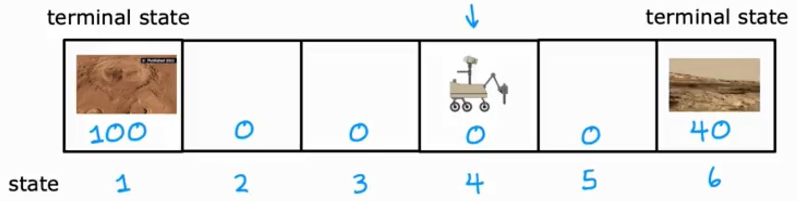

# Week 3 - Reinforcement learning

## What is Reinforcement Leaning

For the jobs like autonomous flying helicopter, we can't use supervised learning to train the model. Because we can't get the data set of the helicopter flying. So we need to use reinforcement learning to train the model.

In reinforcement learning, we don't have the data set. We only have the reward function. We can use the reward function to train the model.

In reinforcement learning, instead of telling the model what to do, we tell the model what is good and what is bad. Then the model will learn from the reward function.

Applications:

- Controlling robots
- Factory optimization
- Financial (stock) trading
- Playing games (including video games)

## Mars rover example

A robot is on Mars and it has to get to the goal. The robot can move forward or backward. In each step, the robot gets a reward. The robot has to get to the goal with the maximum reward.

The rewarded steps at the two ends, are called _terminal state_ because the robot can't move forward or backward from there.

At every time-step, the robot gets a reward. The robot is at state $s$, and it gets to choose an action $a$, and it gets a reward $R(s)$ and it gets to a new state $s'$: $(s, a, R(s), s')$

For example when robot is at state $4$, it take the action of going to the left, and gets $0$ reward, and then it will be at state $3$: $(4, \leftarrow, 0, 3)$

## The Return in reinforcement learning

The output of reward function may vary and we may have to take some steps without gaining any reward to reach a good reward at last, but what defines if it worth it or not?

Here we define _Discount Factor_ ($\gamma$) which is a little bit less than $1$ and we use it to define the return of the reward function.

For example with $\gamma = 0.9$, the total reward is:

$$
R = \sum^{\infty}_{k=0} \gamma^k r_{k+1}
$$

In financial application, the discount factor has a natural interpretation as the interest rate or the time value of money.

To summarize, the return is sum of the rewards that the system gets, weighted by the discount factor.

## Making decisions: Policies in reinforcement learning

A policy is a function $\pi(s) = a$ mapping from states to actions, that tells you what action a to take in a given state $s$.

Our goal reinforcement learning is to find a policy $\pi$ that tells you what action ($a = \pi(s)$) to take in every state ($s$) so as to maximize the return.

## Review of key concepts

Markov Decision Process (MDP): This term refers to that the future only depends on the current state, not the past states. In other words, future only depends on what you are now, not how you got here.

## State-action value function definition

The state-action value function $Q(s, a)$ is the expected return starting from state $s$, taking action $a$, and then following policy $\pi$.

$Q(s, a)$ = Return if you

- start in state $s$
- take action $a$ (once)
- then behave optimally after that.

_note)_ State-action function is also called Q-function, Q*, and Optimal Q-function.

_note)_ The best possible return from state $s$ is $\underset{a}{\max} Q(s, a)$

_note)_ The best possible action in state $s$ is the action $a$ that gives $\underset{a}{\max} Q(s, a)$

## State-action value function example

Increasing the terminal reward will increase the Q-function value of moving toward that terminal state and makes it worth to walk toward it even if it takes a lot of steps.

On the other hand decreasing the discount factor $\gamma$ will make the algorithm more impatient and it will try to walk toward the closest reward.

## Bellman equation

- $s$: current state
- $a$: current action
- $R(s)$: reward of current state
- $s'$: state you get after taking action $a$
- $a'$: action that you take in state $s'$

$$
Q(s, a) = \underbrace{R(s)}_{\text{immediate reward}} + \gamma \underbrace{\underset{a'}{\max} Q(s', a')}_{\text{discounted future reward}}
$$

## Random (stochastic) environment

When there's a random environment, the possiblity of mars rover going to the right direction decreases from $1$, so the Q-function value of going to the right decreases. So the job of reinforcement learning is to find the best policy $\pi$ that maximizes the average of discounted reward.

$$
\text{Expected Return} = \text{Average}(R_1 + \gamma R_2 + \gamma^2 R_3 + \dots) = \mathbf{E}[R_1 + \gamma R_2 + \gamma^2 R_3 + \dots]
$$

- In statistics the _Expected_ is another term for average
- $\mathbf{E}$ refers to the expected value

Bellman equation for random environment:

$$
Q(s, a) = R(s) + \gamma\ \mathbf{E}[\underset{a'}{\max} Q(s', a')]
$$

